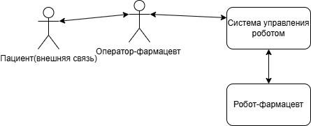
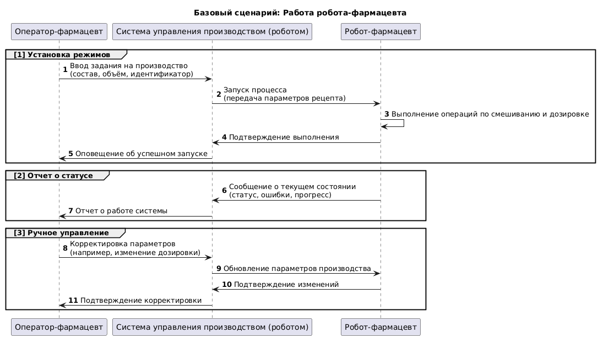
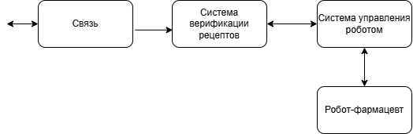
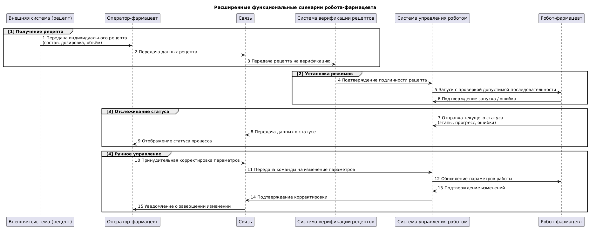
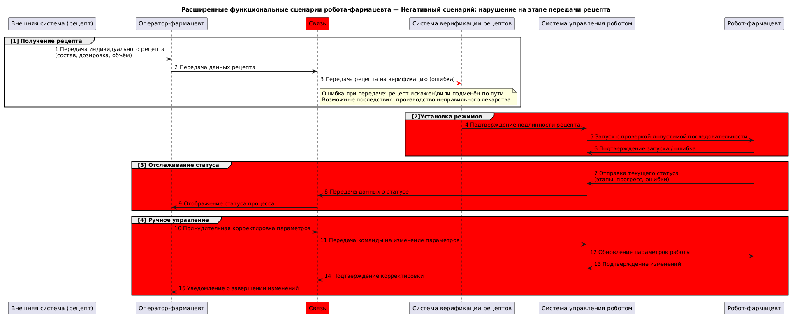
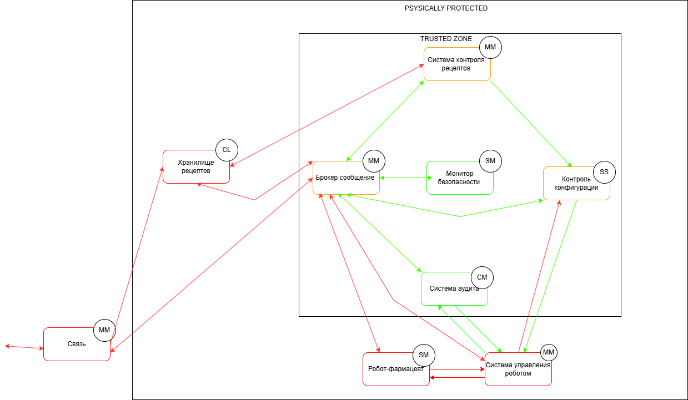

# Робот-фармацевт


## Краткое описание проектируемой системы

Продукт - робот-фармацевт, который производит лекарство по индивидуальному рецепту.
Рецепт включает в себя:
a) точный состав и количество компонентов, порядок и условия изготовления конечного продукта;
б) уникальный идентификатор лекарства, который изготавливается в определённом объёме для индивидуального
курса лечениявалифицированным персоналом без необходимости изменения системного ПО.

## Ключевые ценности, ущербы, неприемлемые события

| Ценность | Нежелательные события | Величина ущерба | Комментарий |
|----------|-----------------------|-|------------|
| Лекарство | Нарушение технологичского процесса | Высокий | Возможно причинение вреда здоровью клиента  | 
| Рецептура | Неавторизованный доступ к рецептуре (раскрытие торгового секрета) | Выскокий | Конкуренты смогут производить аналоги. PR риски из-за публикации рецептуры (критично для дорогостоящего БАДов и прочей геопатии) |
| Персональные данные | Неавторизованный доступ к персональным данных клиентов | Высокий | Оборотный штраф для организации| 
Робот | Невозможность производства лекарства из-за отказа оборудования | Средний | При необходимости сотруник фармацевт сможет вручную приготовить небольшие партии лекарства| 
| Люди | Отправление из-за приёма неправильного лекарства | Высокий | Возможно причинение вреда здоровью клиента |

## Роли пользователей

| Роль | Назначение |
|----------|-----------------------|
| Оператор-фармацевт | Вводит задание на производство и получает лекарство дл передачи клиенту | 
| Пациент | Получает рецепт от врача в клинике и по этому рецепту получает лекарство в аптеке |

## Контекст



## Основные функциональные сценарии


## Высокоуровневая архитектура

## Описание подсистем
| Название | Назначение |
|----------|-----------------------|
| Связь  | 	Обеспечивает передачу данных между подсистемами.| 
| Система управления роботом| Контролирует процесс производства: отправляет команды роботу, получает и анализирует его состояние, обеспечивает выполнение технологической последовательности.|
| Робот-фармацевт  | 	Выполняет операции по смешиванию, дозировке и упаковке лекарственных средств.| 
| Система верификации рецептов| 	Проверяет подлинность и корректность полученного рецепта, включая состав, дозировку и уникальные идентификаторы, а также подтверждает, что рецепт выдан авторизованным источником и соответствует установленным медицинским стандартам и регламентам.
|

## Расширенные диаграммы функциональных сценариев


## Цели и предположения безопасности

#### Цели безопасности
1. Состав лекарства, приготовленного роботом, совпадает с рецептурными параметрами, заданными авторизованным оператором..

2. Доступ к рецептурной информации и персональным данным клиентов возможен только для авторизованных ролей через доверенные каналы и средства.

3. Функциональное состояние роботизированного комплекса подтверждается встроенной системой самодиагностики, и управление недоступно при выявленных критических неисправностях.
4. Данные, передаваемые клиенту должны быть целостными и аутентичными

####  Предположения безопасности
1. Физическая защита: Потенциальный злоумышленник не имеет физического доступа к роботу-фармацевту, его сенсорам, исполнительным устройствам и коммуникационным портам.

2. Контроль доступа: Только аутентифицированные и авторизованные пользователи имеют доступ к интерфейсу управления роботом и к его программной конфигурации.

3. Благонадежность пользователей: Авторизованные пользователи не действуют злонамеренно и не стремятся преднамеренно нарушить работоспособность системы или компрометировать данные.

4. Изолированность среды исполнения: Программное обеспечение робота исполняется в среде, защищённой от внедрения стороннего кода извне, при условии соблюдения организационных мер защиты.

5. Сетевая безопасность обеспечена извне: Защита от сетевых атак (например, MitM или DoS) на внешние каналы связи обеспечивается средствами внешней инфраструктуры (например, фильтрацией трафика на уровне шлюзов).

## Таблица соотнесения ценностей, неприемлемых событий и целей безопасности
| Ценность | Негативное событие | Оценка ущерба | Цель безопасности |
|----------|-----------------------|-|--------|
| Лекарство | Нарушение технологичского процесса | Высокий | 1 | 
| Рецептура | Неавторизованный доступ к рецептуре (раскрытие торгового секрета) | Выскокий |2|
| Персональные данные | Неавторизованный доступ к персональным данных клиентов | Высокий |2| 
Робот | Невозможность производства лекарства из-за отказа оборудования | Средний | 3| 
| Люди | Отправление из-за приёма неправильного лекарства | Высокий | 4 |

## Негативные сценарии


 ## Политика архитектуры 
 #### Реализация 1

 
 | Домен безопасности | Уровень доверия | Оценка сложности и размера домена | Обоснование |
|----------|-----------------------|-|--------|
| Связь | Недоверенный| MM| При компрометации нарушение целостности данных блокируется проверкой в системе управления производством.| 
| Система управления роботом| Доверенный, повышающий целостность данных | СM|Отвечает за точность исполнения рецепта и технологическую последовательность. При компрометации возникает риск некорректного производства.|
| Робот-фармацевт | Доверенный | SM |При компрометации возможно нарушение технологического процесса.| 
Система контроля рецептов| Недоверенный | MM | Анализирует полученный рецепт на подлинность. Ошибки или атаки могут привести к принятию недействительного или изменённого рецепта.| 
| Система распознавания запросов | Доверенный, повышающий целостность данных | MM | Принимает и анализирует входящие запросы. Даже при компрометации не нарушает безопасность, так как рецепты проверяются отдельно. Фильтрует заведомо недопустимые запросы, снижая риски на раннем этапе. |
Система аудита | Доверенный| SS |   Обеспечивает контроль технического состояния. Подмена информации в ней может привести к эксплуатации неисправных узлов|
| Контроль конфигурации| Доверенный, повышающий целостность данных| SS |Критическая подсистема, гарантирующая соответствие производственного процесса утверждённым параметрам. При её компрометации нарушается вся модель доверия.|
| Хранилище рецептов | Доверенный| MM|Уязвим для атак, так как получает данные извне. Может содержать поддельные или искажённые рецепты. Надёжность обеспечивается дальнейшей проверкой.|
 #### Реализация 2
 

| Домен безопасности | Уровень доверия | Оценка сложности и размера домена | Обоснование |
|----------|-----------------------|-|--------|
| Связь | Недоверенный| MM| Находится вне доверенной зоны. Возможна подмена или искажение данных извне. Угрозы смягчаются системой верификации и контролем конфигурации.|
| Система распознавания запросов | Доверенный, повышающий целостность данных | MM | Принимает и анализирует входящие запросы. Даже при компрометации не нарушает безопасность, так как рецепты проверяются отдельно. Фильтрует заведомо недопустимые запросы, снижая риски на раннем этапе. |
| Хранилище рецептов | Доверенный| MM|Уязвим для атак, так как получает данные извне. Может содержать поддельные или искажённые рецепты. Надёжность обеспечивается дальнейшей проверкой.| 
| Система управления роботом| Недоверенный |CM |    Подвержена атаке через команды от брокера. Проверяется системой конфигурации. При сбое может нарушить работу производственного процесса.|| Робот-фармацевт | Недоверенный | MM | Выполняет производство. Уязвим к недостоверным управляющим командам. Компрометация влияет на физический результат.| 
| Система контроля рецептов| Доверенный, повышающий целостность данных | MM |Работает в доверенной зоне. Проверяет рецепты на корректность и подлинность, фильтрует недостоверные данные.| Контроль конфигурации| Доверенный, повышающий целостность данных| SS |Критическая подсистема, гарантирующая соответствие производственного процесса утверждённым параметрам. При её компрометации нарушается вся модель доверия.|
Брокер сообщений| Доверенный, повышающий целостность данных| MM |Центр маршрутизации сообщений, получает данные как от доверенных, так и недоверенных компонентов. Риски снижены за счёт мониторинга и верификации.|Монитор безопасности| Доверенный| SM |Отвечает за контроль работы подсистем, регистрирует нарушения. Вмешательство в него может скрыть атаки.|
Система аудита | Доверенный| SS |   Обеспечивает контроль технического состояния. Подмена информации в ней может привести к эксплуатации неисправных узлов|

####  Политики безопасности
Реализация в виде кода : 
```
 python
import base64
VERIFIER_SEAL = 'verifier_seal'

def check_operation(id, details):
    authorized = False
    # print(f"[debug] checking policies for event {id}, details: {details}")
    print(f"[info] checking policies for event {id},"
          f" {details['source']}->{details['deliver_to']}: {details['operation']}")
    src = details['source']
    dst = details['deliver_to']
    operation = details['operation']
    if src == 'storage' and dst == 'sistem verifier' and operation == 'verification_requested':
        authorized = True
    if src == 'storage' and dst == 'message broker' and operation == 'updating_data':
        authorized = True
    if src == 'sistem verifier' and dst == 'message broker' and operation == 'handle_verification_result':
        authorized = True
    if src == 'message broker' and dst == 'security monitor' and operation == 'updating_data' \
        and details['verified'] is True:
        authorized = True
    if src == 'message broker' and dst == 'security monitor' and operation == 'updating_data' \
        and details['configured'] is True:
        authorized = True
    if src == 'message broker' and dst == 'system diagnostics' and operation == 'handle_diagnostic_result':
        authorized = True
    if src == 'message broker' and dst =='system diagnostics' and operation == 'diagnostic_requested':
        authorized = True
    if src == 'management system' and dst =='robot' and operation == 'updating_data':
        authorized = True
    if src == 'security monitor' and dst =='robot' and operation == 'updating_data':
        authorized = True
    if src == 'management system' and dst =='system diagnostics' and operation == 'updating_data':
        authorized = True
    if src == 'message broker' and dst =='management system' and operation == 'diagnostic_requested':
        authorized = True
    if src == 'message broker' and dst == 'configuration control' and operation == 'handle_diagnostic_result':
        authorized = True
    if src == 'message broker' and dst =='configuration control' and operation == 'diagnostic_requested':
        authorized = True
    if src == 'message broker' and dst =='configuration control' and operation == 'updating_data':
        authorized = True
    if src == 'configuration control' and dst == 'sistem verifier' and operation == 'verification_requested':
        authorized = True
    if src == 'sistem verifier' and dst == 'configuration control' and operation == 'handle_verification_result':
        authorized = True

    return authorized


def check_payload_seal(payload):
    try:
        p = base64.b64decode(payload).decode()
        if p.endswith(VERIFIER_SEAL):
            print('[info] payload seal is valid')
            return True
    except Exception as e:
        print(f'[error] seal check error: {e}')
        return False
```
