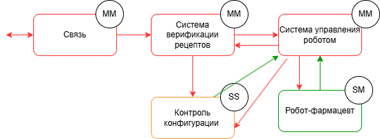

# Робот-фармацевт

## Краткое описание проектируемой системы

Продукт - робот-фармацевт, который производит лекарство по индивидуальному рецепту.
Рецепт включает в себя:
a) точный состав и количество компонентов, порядок и условия изготовления конечного продукта;
б) уникальный идентификатор лекарства, который изготавливается в определённом объёме для индивидуального
курса лечениявалифицированным персоналом без необходимости изменения системного ПО.

## Ключевые ценности, ущербы, неприемлемые события

| Ценность | Нежелательные события | Величина ущерба | Комментарий |
|----------|-----------------------|-|------------|
| Лекарство | Нарушение технологичского процесса | Высокий | Возможно причинение вреда здоровью клиента  | 
| Рецептура | Неавторизованный доступ к рецептуре (раскрытие торгового секрета) | Выскокий | Конкуренты смогут производить аналоги. PR риски из-за публикации рецептуры (критично для дорогостоящего БАДов и прочей геопатии) |
| Персональные данные | Неавторизованный доступ к персональным данных клиентов | Высокий | Оборотный штраф для организации| 
Робот | Невозможность производства лекарства из-за отказа оборудования | Средний | При необходимости сотруник фармацевт сможет вручную приготовить небольшие партии лекарства| 
| Люди | Отправление из-за приёма неправильного лекарства | Высокий | Возможно причинение вреда здоровью клиента |

## Роли пользователей

| Роль | Назначение |
|----------|-----------------------|
| Оператор-фармацевт | Вводит задание на производство и получает лекарство дл передачи клиенту | 
| Пациент | Получает рецепт от врача в клинике и по этому рецепту получает лекарство в аптеке |

## Контекст

## Основные функциональные сценарии

## Высокоуровневая архитектура

## Описание подсистем
| Название | Назначение |
|----------|-----------------------|
| Связь  | 	Обеспечивает передачу данных между подсистемами.| 
| Система управления роботом| Контролирует процесс производства: отправляет команды роботу, получает и анализирует его состояние, обеспечивает выполнение технологической последовательности.|
| Робот-фармацевт  | 	Выполняет операции по смешиванию, дозировке и упаковке лекарственных средств.| 
| Система верификации рецептов| 	Проверяет подлинность и корректность полученного рецепта, включая состав, дозировку и уникальные идентификаторы, а также подтверждает, что рецепт выдан авторизованным источником и соответствует установленным медицинским стандартам и регламентам.
|

## Расширенные диаграммы функциональных сценариев

## Цели и предположения безопасности

#### Цели безопасности
1. Состав лекарства, приготовленного роботом, совпадает с рецептурными параметрами, заданными авторизованным оператором..

2. Доступ к рецептурной информации и персональным данным клиентов возможен только для авторизованных ролей через доверенные каналы и средства.

3. Функциональное состояние роботизированного комплекса подтверждается встроенной системой самодиагностики, и управление недоступно при выявленных критических неисправностях.
4. Данные, передаваемые клиенту должны быть целостными и аутентичными

####  Предположения безопасности
1. Физическая защита: Потенциальный злоумышленник не имеет физического доступа к роботу-фармацевту, его сенсорам, исполнительным устройствам и коммуникационным портам.

2. Контроль доступа: Только аутентифицированные и авторизованные пользователи имеют доступ к интерфейсу управления роботом и к его программной конфигурации.

3. Благонадежность пользователей: Авторизованные пользователи не действуют злонамеренно и не стремятся преднамеренно нарушить работоспособность системы или компрометировать данные.

4. Изолированность среды исполнения: Программное обеспечение робота исполняется в среде, защищённой от внедрения стороннего кода извне, при условии соблюдения организационных мер защиты.

5. Сетевая безопасность обеспечена извне: Защита от сетевых атак (например, MitM или DoS) на внешние каналы связи обеспечивается средствами внешней инфраструктуры (например, фильтрацией трафика на уровне шлюзов).

## Таблица соотнесения ценностей, неприемлемых событий и целей безопасности
| Ценность | Негативное событие | Оценка ущерба | Цель безопасности |
|----------|-----------------------|-|--------|
| Лекарство | Нарушение технологичского процесса | Высокий | 1 | 
| Рецептура | Неавторизованный доступ к рецептуре (раскрытие торгового секрета) | Выскокий |2|
| Персональные данные | Неавторизованный доступ к персональным данных клиентов | Высокий |2| 
Робот | Невозможность производства лекарства из-за отказа оборудования | Средний | 3| 
| Люди | Отправление из-за приёма неправильного лекарства | Высокий | 4 |

## Негативные сценарии

 ## Политика архитектуры 
 #### Логическая 1

 
 | Домен безопасности | Уровень доверия | Оценка сложности и размера домена | Обоснование |
|----------|-----------------------|-|--------|
| Связь | Недоверенный| MM| При компрометации нарушение целостности данных блокируется проверкой в системе управления производством.| 
| Система управления роботом| Доверенный, повышающий целостность данных | MM|Отвечает за точность исполнения рецепта и технологическую последовательность. При компрометации возникает риск некорректного производства.|
| Робот-фармацевт | Доверенный | SM |При компрометации возможно нарушение технологического процесса.| 
Система верификации рецептов| Недоверенный | MM | Анализирует полученный рецепт на подлинность. Ошибки или атаки могут привести к принятию недействительного или изменённого рецепта.| 

 #### Реализация 2
 
 
 | Домен безопасности | Уровень доверия | Оценка сложности и размера домена | Обоснование |
|----------|-----------------------|-|--------|
| Связь | Недоверенный| MM| При компрометации нарушение целостности данных блокируется проверкой в системе контроля конфигураций.| 
| Система управления роботом| Недоверенный| MM |При компрометации нарушение целостности данных блокируется проверкой в системе контроля конфигураций.|
| Робот-фармацевт | Доверенный | SM |При компрометации возможно нарушение технологического процесса.| 
Система верификации рецептов| Недоверенный | MM |При атаке может быть подменён рецепт или допущен недостоверный, что влияет на достоверность исходных данных.| 
Контроль конфигурации| Доверенный, повышающий целостность данных| SS |Критическая подсистема, гарантирующая соответствие производственного процесса утверждённым параметрам. При её компрометации нарушается вся модель доверия.|
